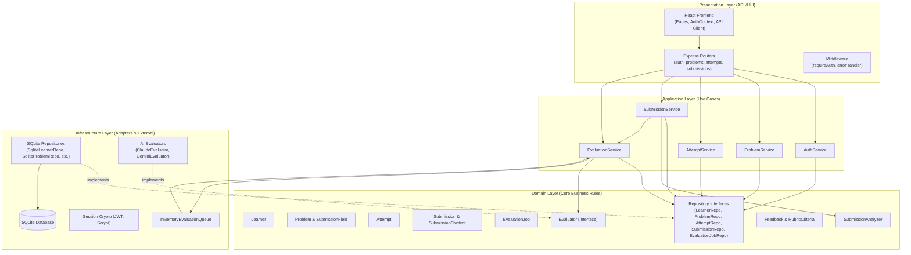
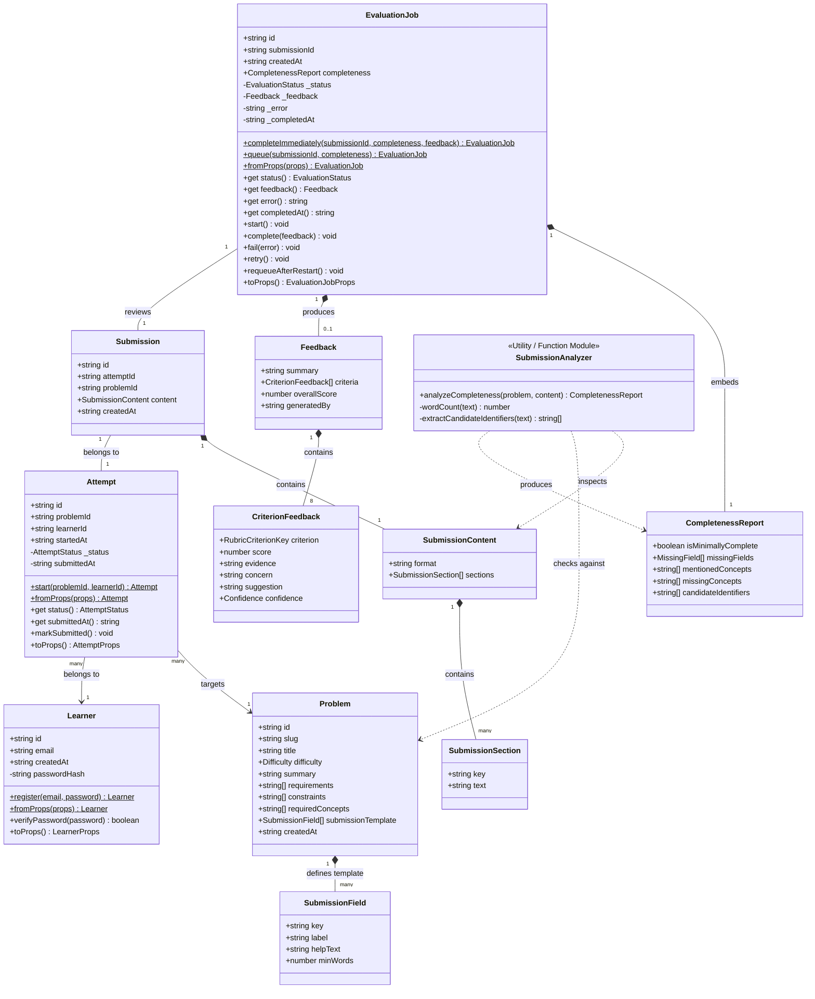
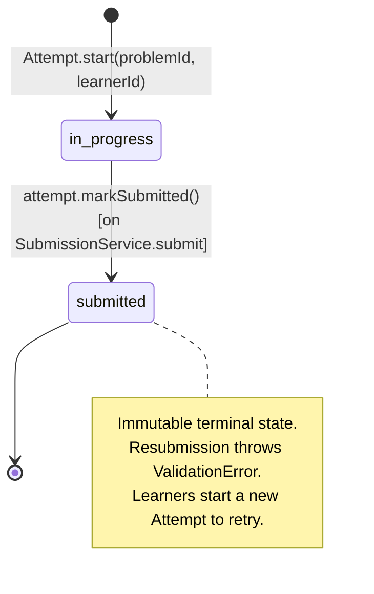
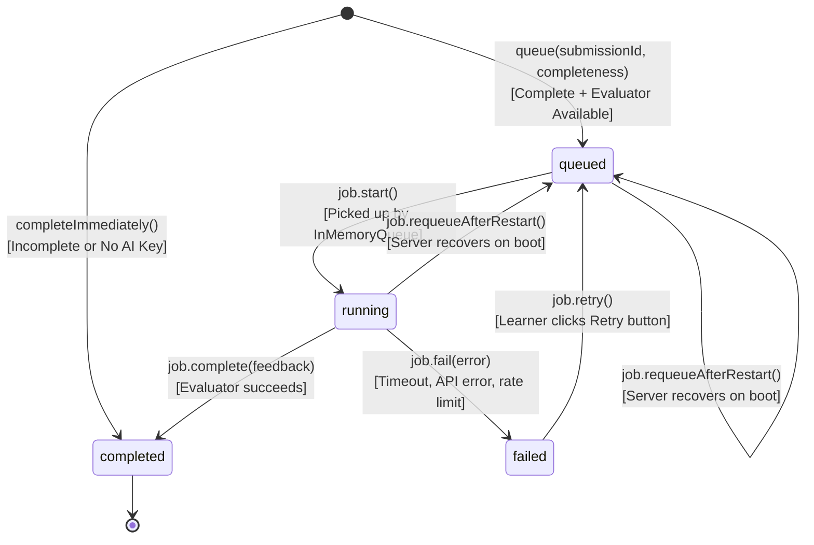
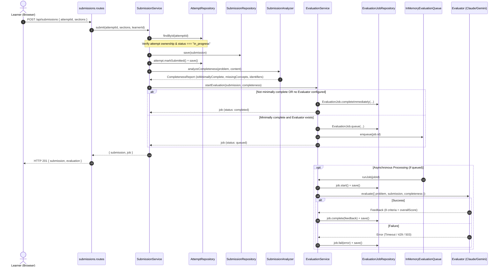

# Low-Level Design (LLD) & Class Diagram

This document provides a comprehensive Low-Level Design (LLD) specification of the **LLD Practice Platform**, covering class structures, properties, methods, design patterns, relationships, and execution lifecycles across the Domain, Application, Infrastructure, and Presentation layers.

---

## 1. Clean Architecture & Layered Overview

The project adheres to **Domain-Driven Design (DDD)** and **Clean Architecture (Hexagonal / Ports & Adapters)** principles:

---

## 2. Core Domain Model Class Diagram

The Domain layer is purely algorithmic and object-oriented TypeScript with no external framework dependencies.

---

## 3. Application Services & Repository Ports

The Application layer contains use case handlers (services) that coordinate business entities and interact with persistence via ports (repository interfaces).

```mermaid
classDiagram
    direction TB

    %% Service Classes
    class AuthService {
        -LearnerRepository learners
        -string jwtSecret
        +signup(email, password) Promise~AuthResult~
        +login(email, password) Promise~AuthResult~
        +getById(learnerId) Promise~Learner~
    }

    class ProblemService {
        -ProblemRepository problems
        +listAll() Promise~Problem[]~
        +getById(id) Promise~Problem~
    }

    class AttemptService {
        -AttemptRepository attempts
        -ProblemRepository problems
        +start(problemId, learnerId) Promise~Attempt~
        +getById(id, learnerId) Promise~Attempt~
        +listForLearner(learnerId) Promise~Attempt[]~
    }

    class SubmissionService {
        -SubmissionRepository submissions
        -AttemptRepository attempts
        -ProblemRepository problems
        -EvaluationService evaluationService
        +submit(attemptId, sections, learnerId) Promise~SubmitResult~
        +getStatus(submissionId, learnerId) Promise~SubmitResult~
        +getByAttempt(attemptId) Promise~Submission~
    }

    class EvaluationService {
        -EvaluationJobRepository jobs
        -SubmissionRepository submissions
        -ProblemRepository problems
        -Evaluator evaluator
        -InMemoryEvaluationQueue queue
        +startEvaluation(submission, completeness) Promise~EvaluationJob~
        +getBySubmission(submissionId) Promise~EvaluationJob~
        +retry(jobId) Promise~EvaluationJob~
        +recoverStuckJobs() Promise~void~
        -runJob(jobId) Promise~void~
    }

    %% Interfaces (Ports)
    class LearnerRepository {
        <<interface>>
        +save(learner) Promise~void~
        +findById(id) Promise~Learner~
        +findByEmail(email) Promise~Learner~
    }

    class ProblemRepository {
        <<interface>>
        +findAll() Promise~Problem[]~
        +findById(id) Promise~Problem~
        +findBySlug(slug) Promise~Problem~
    }

    class AttemptRepository {
        <<interface>>
        +save(attempt) Promise~void~
        +findById(id) Promise~Attempt~
        +findByLearner(learnerId) Promise~Attempt[]~
    }

    class SubmissionRepository {
        <<interface>>
        +save(submission) Promise~void~
        +findById(id) Promise~Submission~
        +findByAttempt(attemptId) Promise~Submission~
    }

    class EvaluationJobRepository {
        <<interface>>
        +save(job) Promise~void~
        +findById(id) Promise~EvaluationJob~
        +findBySubmission(submissionId) Promise~EvaluationJob~
        +findQueuedOrRunning() Promise~EvaluationJob[]~
    }

    class Evaluator {
        <<interface>>
        +string name
        +evaluate(input) Promise~Feedback~
    }

    class InMemoryEvaluationQueue {
        -string[] pending
        -boolean draining
        -JobHandler handler
        +enqueue(jobId) void
        -drain() Promise~void~
    }

    AuthService --> LearnerRepository
    ProblemService --> ProblemRepository
    AttemptService --> AttemptRepository
    AttemptService --> ProblemRepository
    SubmissionService --> SubmissionRepository
    SubmissionService --> AttemptRepository
    SubmissionService --> ProblemRepository
    SubmissionService --> EvaluationService
    EvaluationService --> EvaluationJobRepository
    EvaluationService --> SubmissionRepository
    EvaluationService --> ProblemRepository
    EvaluationService --> Evaluator
    EvaluationService *-- InMemoryEvaluationQueue
```

---

## 4. Infrastructure Adapters (Database & AI Implementations)

The Infrastructure layer implements the domain interfaces (Ports) using concrete technologies (better-sqlite3, Anthropic Claude SDK, Google Gemini SDK).

```mermaid
classDiagram
    direction TB

    class LearnerRepository {
        <<interface>>
    }
    class ProblemRepository {
        <<interface>>
    }
    class AttemptRepository {
        <<interface>>
    }
    class SubmissionRepository {
        <<interface>>
    }
    class EvaluationJobRepository {
        <<interface>>
    }
    class Evaluator {
        <<interface>>
        +string name
        +evaluate(input) Promise~Feedback~
    }

    class SqliteLearnerRepository {
        -Database db
        +save(learner) Promise~void~
        +findById(id) Promise~Learner~
        +findByEmail(email) Promise~Learner~
    }

    class SqliteProblemRepository {
        -Database db
        +findAll() Promise~Problem[]~
        +findById(id) Promise~Problem~
        +findBySlug(slug) Promise~Problem~
        +insert(problem) void
    }

    class SqliteAttemptRepository {
        -Database db
        +save(attempt) Promise~void~
        +findById(id) Promise~Attempt~
        +findByLearner(learnerId) Promise~Attempt[]~
    }

    class SqliteSubmissionRepository {
        -Database db
        +save(submission) Promise~void~
        +findById(id) Promise~Submission~
        +findByAttempt(attemptId) Promise~Submission~
    }

    class SqliteEvaluationJobRepository {
        -Database db
        +save(job) Promise~void~
        +findById(id) Promise~EvaluationJob~
        +findBySubmission(submissionId) Promise~EvaluationJob~
        +findQueuedOrRunning() Promise~EvaluationJob[]~
    }

    class ClaudeEvaluator {
        +string name = "claude-lld-rubric-v1"
        -Anthropic client
        -string model
        +evaluate(input) Promise~Feedback~
    }

    class GeminiEvaluator {
        +string name = "gemini-lld-rubric-v1"
        -GoogleGenAI client
        -string model
        +evaluate(input) Promise~Feedback~
    }

    SqliteLearnerRepository ..|> LearnerRepository
    SqliteProblemRepository ..|> ProblemRepository
    SqliteAttemptRepository ..|> AttemptRepository
    SqliteSubmissionRepository ..|> SubmissionRepository
    SqliteEvaluationJobRepository ..|> EvaluationJobRepository
    ClaudeEvaluator ..|> Evaluator
    GeminiEvaluator ..|> Evaluator
```

---

## 5. State Machine Lifecycles

### 5.1 Attempt State Machine
Enforces that each practice attempt is single-use, preventing overwrite of history.

### 5.2 EvaluationJob State Machine
Tracks evaluation from synchronous completeness triage to asynchronous AI feedback and manual retry.

---

## 6. End-to-End Submission Sequence Diagram

This diagram explains how classes interact when a learner submits their design:

---

## 7. Class Responsibilities & Design Patterns Reference

| Class / Module | Layer | Primary Pattern | Responsibilities & Design Decisions |
| :--- | :--- | :--- | :--- |
| **`Learner`** | Domain | Rich Entity, Factory | Manages account identity. Enforces email format & password length. Performs scrypt hashing and timing-safe verification directly without external infrastructure leaks. |
| **`Problem`** | Domain | Value Object | Read-only problem definition with structured submission fields (`SubmissionField`) and domain keywords (`requiredConcepts`). |
| **`Attempt`** | Domain | Entity, State Machine | Represents a practice session on a problem. Enforces single-submission invariant (`markSubmitted()` raises error if already submitted). |
| **`Submission`** | Domain | Value Object Snapshot | Immutable snapshot of a learner's answers. Uses discriminated union `SubmissionContent` (`format: "structured-text"`) for forward extensibility. |
| **`SubmissionAnalyzer`** | Domain | Pure Function / Domain Service | Evaluates word count per section and extracts PascalCase identifiers (`FeeCalculator`) and problem concepts without calling an LLM. |
| **`EvaluationJob`** | Domain | Entity, State Machine | State machine for evaluation (`queued` $\to$ `running` $\to$ `completed`/`failed`). Handles instant completion, restart recovery, and retries. |
| **`Evaluator`** | Domain | Strategy Interface | Open/Closed interface defining the contract for evaluation (`evaluate(input): Promise<Feedback>`). |
| **`ClaudeEvaluator`** | Infrastructure | Concrete Strategy, Adapter | Evaluates submissions using Anthropic Claude SDK with Zod output format and structured schema. |
| **`GeminiEvaluator`** | Infrastructure | Concrete Strategy, Adapter | Evaluates submissions using Google GenAI SDK with JSON schema + Zod validation. Disables library backoff to fail fast. |
| **`InMemoryEvaluationQueue`**| Infrastructure | Serial Worker Queue | Serializes async evaluation tasks in-process to avoid SQLite database locking. |
| **`AuthService`** | Application | Use Case Orchestrator | Coordinates learner registration, login verification, and JWT session token generation. |
| **`SubmissionService`** | Application | Use Case Orchestrator | Validates submission sections against problem template, persists submission, marks attempt submitted, and triggers evaluation. |
| **`EvaluationService`** | Application | Use Case Orchestrator | Routes evaluation based on completeness, feeds jobs into queue, handles manual retry, and executes restart recovery. |
| **`createServer`** | API / Presentation | Composition Root / DI | Wires dependencies (SQLite connection, repositories, evaluators, services, express routers) together cleanly. |
